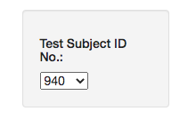
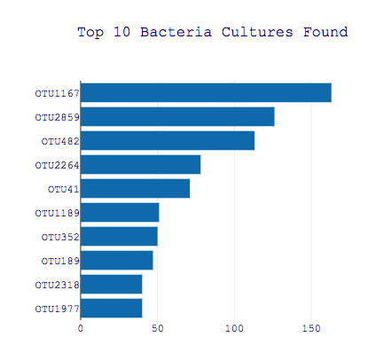
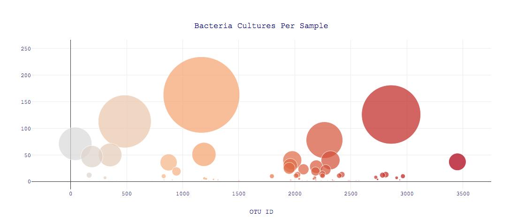
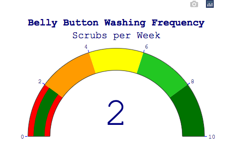
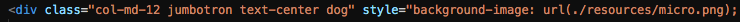
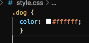

# Plotly: Belly Button BioDiversity
## Project Overview
We have been tasked with helping Roza complete a project for Improbable Beef, a company interested in bacteria synthesizing proteins that have a beef-like taste. Roza hypothesized that this microbacteria is in fact found in the human navel! She has taken samples of navel bacteria across the country in order to build her database. With the samples, Roza and I were able to create a dashboard that visualizes the bacterial data for both fellow researchers and those who participated in the study (each subject was given and #ID and remained annomyus). The subjects will be able to select their ID and the dashboard will display multiple tables with the results of their navel bacteria. This way, if Improbable Beef is to identify a species as a candidate to manufacture synthetic beef, Roza's volunteers will know whether that species is found in their navel.
## Results with Detail Analysis
### Deliverable 1: Create a Horizontal Bar Chart
Created a horizonatal bar chart to display sample_values, otu_ids, and implemted a hover text effect to the bars using otu_labels. 

- The bar chart was created using the buildCharts(); funtion and was written to display the the data for the test subject selcted in the dropdown menu. 

### Deliverable 2: Create a Bubble Chart
Created a bubble chart to display the following information when an subject's ID is selected from the menu: otu_ids on the x-axis, sample_values on the y-axis, sample_values as the marker size, otu_ids as the marker colors, and otu_labels as the hover-text.

### Deliverable 3: Create a Gauge Chart
For this part of the challenge, we were to create a gauge chart that displays the weekly washing frequency's value for each subject. The value would then be displayed on a scale from 0-10. 

- The gauge was customized to fit data and appropriatley display the results of each subject. 

### Deliverable 4: Customize the Dashboard
As instructed, using my knowledge of HTML and Bootstrap, I customized my dashboard in three different ways: 

1. Added an image to the jumbotron. 
	- Within the index.html, I added a style element into the div class for jumbotron. In order to change the front color, I created a new div named "dog" that held the new font color in a style.css file. 
	 
	
2. Use a custom font with contrast for the colors.
	- As you can see in the images of the graphs above, I customized the font and color to customize my website. To do this, I added an element within each chart layout object:
	- font: { color: "darkblue", family: "Courier New" }
3. Add background color. 
	- I changed the background color to make the graphs stand out a bit more.
	- Added attribute to <body> tag: style="background-color:rgb(214, 203, 203);"
